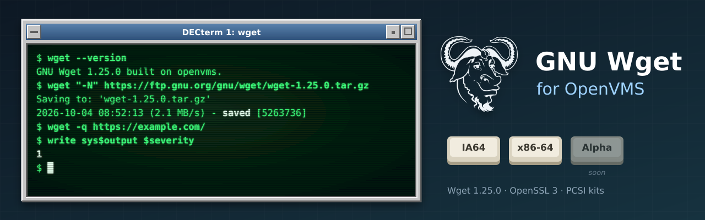

<p align="center">
  
</p>

# GNU Wget for OpenVMS

[](https://github.com/issinoho/vms-wget/releases/latest)
[](https://github.com/issinoho/vms-wget/releases)

[](COPYING)

[GNU Wget](https://www.gnu.org/software/wget/) (**1.25.0**) built natively for OpenVMS on **IA64**
and **x86-64**, following Wget's own releases. It belongs to the same family as
[GNU grep](https://github.com/issinoho/vms-grep), [GNU sed](https://github.com/issinoho/vms-sed),
[GNU awk](https://github.com/issinoho/vms-awk), [GNU make](https://github.com/issinoho/vms-make),
[GNU diffutils](https://github.com/issinoho/vms-diffutils),
[GNU patch](https://github.com/issinoho/vms-patch), [GNU m4](https://github.com/issinoho/vms-m4),
[GNU Bison](https://github.com/issinoho/vms-bison), [flex](https://github.com/issinoho/vms-flex),
[curl](https://github.com/issinoho/vms-curl), [PCRE2](https://github.com/issinoho/vms-pcre2),
[zlib](https://github.com/issinoho/vms-zlib), [bzip2](https://github.com/issinoho/vms-bzip2),
[XZ Utils](https://github.com/issinoho/vms-xz), [Zstandard](https://github.com/issinoho/vms-zstd)
and [MariaDB](https://github.com/issinoho/vms-mariadb) for OpenVMS.

This repository holds **only our changes**: every build starts from the signed GNU release
tarball (Darshit Shah's key, pinned in `keys/`), applies our patches and adds our VMS files.
Wget no longer ships a VMS build, so it is built the way the grep and sed ports are: Wget's
own `configure` runs on a Linux host with every compile and link test sent to VSI C on the
node, and MMS builds the result.

- **TLS:** VSI's OpenSSL 3.0 kit (SSL3), linked through its shared images.
- **zlib** ([vms-zlib](https://github.com/issinoho/vms-zlib)) for `--compression=gzip` and
  **PCRE2** ([vms-pcre2](https://github.com/issinoho/vms-pcre2)) for `--regex-type=pcre`,
  both linked statically.
- **CA certificates:** the kit ships curl.se's extract of Mozilla's root store, named in the
  system startup file, so HTTPS works without `--ca-certificate`.

## Status

| | IA64 (OpenVMS V8.4-2L3, VSI C 7.4) | x86-64 (OpenVMS E9.2-4, VSI C 7.7) |
|---|---|---|
| Builds (VSI C configure answers identical on both) | yes | yes |
| Smoke test (HTTP, HTTPS with and without the CA bundle, gzip, `-O -`, PCRE2, error status, download over an older fixed-record version) | 9/9 | 9/9 |
| Batch job (download; a failure trips `ON ERROR`) | yes | yes (TRADITIONAL parse style) |
| PCSI kit ([v1.25.0-vms2](https://github.com/issinoho/vms-wget/releases/tag/v1.25.0-vms2)) | `ISSINOHO-I64VMS-WGET-V0125-0E2-1.PCSI` | `ISSINOHO-X86VMS-WGET-V0125-0E2-1.PCSI` |

Not in this build: IDN (internationalised domain names), the public suffix list, metalink,
c-ares, extended attributes and `--use-askpass`.

## Installing the kit

The kit needs VSI's **SSL3** kit (OpenSSL 3.0). Download the kit for your architecture from
the [latest release](https://github.com/issinoho/vms-wget/releases/latest) and check it
against the release's `SHA256SUMS`. A kit downloaded through a non-VMS system loses its
record format, so restore that first, then install it:

```
$ SET FILE/ATTRIBUTE=(RFM:FIX,LRL:8192,MRS:8192,RAT:NONE) ISSINOHO-*-WGET-V0125-0E2-1.PCSI
$ PRODUCT INSTALL WGET /PRODUCER=ISSINOHO /SOURCE=dev:[dir]
$ @WGET$ROOT:[000000]WGET$SETUP.COM
```

It installs `WGET.EXE` under `[WGET.BIN]`, the system startup file `[WGET.ETC]WGETRC.`, the CA
bundle `[WGET.SSL]CACERT.PEM`, `WGET$SETUP.COM` (defines the `wget` command; add it to
`LOGIN.COM` or `SYLOGIN.COM`), the documentation in `[WGET.DOC]` (the manual as `WGET.TXT`),
and `SYS$STARTUP:WGET$STARTUP.COM`, which defines `WGET$ROOT` (add
`$ @SYS$STARTUP:WGET$STARTUP.COM` to `SYS$MANAGER:SYSTARTUP_VMS.COM` to define it at every
boot). `PRODUCT REMOVE WGET` removes it and deassigns `WGET$ROOT`. The kit's version
`V1.25-0E2` is Wget 1.25.0 with our patch level as the ECO.

## Using wget on VMS

- **Startup files and certificates.** wget reads `WGET$ROOT:[ETC]WGETRC.` (compiled in),
  then `SYS$LOGIN:.WGETRC` or the file the logical name `WGETRC` names. The system file sets
  `ca_certificate = WGET$ROOT:[SSL]CACERT.PEM`. The kit replaces it on upgrade, so keep site
  settings in a file of your own and point the logical name `SYSTEM_WGETRC` at it.
- **Upper-case options in batch jobs.** Under the TRADITIONAL DCL parse style (batch jobs
  use it even when interactive logins are EXTENDED), unquoted options reach wget in lower
  case: `-O` becomes `-o` (log file), `-N` becomes `-n`. Quote them (`"-O"`), or start the
  procedure with `$ SET PROCESS/PARSE_STYLE=EXTENDED`.
- **Exit status.** Under DCL a failed run has error severity, so `ON ERROR` and
  `IF .NOT. $STATUS` work; wget's exit code N (4 network failure, 5 certificate not verified,
  8 server error response, ...) is `($STATUS .AND. %X7F8) / 8`. Under a GNV shell, `$?` is
  the exit code as on Unix. (The C run-time library's POSIX exit gives every code success
  severity; patch 0008 fixes that.)
- **Files.** Downloads are Stream_LF, byte for byte, whatever format an older version of
  the file had. Fetching a file that exists writes a new version (`;2`), not `name.1`. On ODS-5 disks names from URLs are kept (`example^.com`); on ODS-2
  they are made valid ODS-2 names.

## Patches

| Patch | Purpose |
|---|---|
| 0001 | `src/config.h.in`: VSI C's `<assert.h>` is include-guarded, so after gnulib's `#undef assert` it never came back; undefine the guard (`__ASSERT_LOADED`) as gnulib does for IRIX. |
| 0002 | `src/utils.c`, `src/warc.c`: bring Wget's surviving VMS code up to date (a stale `unique_name_passthrough()` signature; `warc.c` needs the C RTL's variadic `fopen()`). |
| 0003 | `lib/dynarray.h`, `lib/scratch_buffer.h`: include the generated `*.gl.h` headers as `*_gl.h` (VSI C cannot include a name with two dots). From vms-sed. |
| 0004 | `configure`: look for `struct sched_param` in `<pthread.h>` for host `openvms*`, not only `vms`. |
| 0005 | `lib/getprogname.c`: VMS implementation. From vms-sed and vms-grep. |
| 0006 | `lib/malloc/scratch_buffer.h`: avoid the member name `__align`, a VSI C keyword. From vms-sed. |
| 0007 | `src/main.c`: no `posix_spawn` (no `fork()` on VMS) for `--use-askpass`, which Wget already leaves out on VMS. |
| 0008 | `lib/stdlib.in.h`: route `exit()` through `vms_exit()`, so a failed run has error severity under DCL and the POSIX status under a GNV shell. |
| 0009 | `src/url.c`: on VMS, report an unsupported file-name encoding conversion only with `-d` (the C RTL has no `iconv` converters unless the internationalisation kit is installed). |
| 0010 | `src/init.c`: join a Unix-style `$HOME` with a slash, so the user's `.wgetrc` and the HSTS database `.wget-hsts` are in the login directory, not one level up. |
| 0011 | `src/http.c`, `main.c`, `ftp.c`, `utils.c`: give every file wget writes its attributes explicitly (Stream_LF, no maximum record size). When the file already exists, the C RTL otherwise gives the new version the old one's: a download over a file with fixed 8192-byte records was padded to whole records or failed with `RMS-F-MRS`. |

Wget's sources keep VMS code from an earlier port whose support files are no longer
distributed; `vms/vms.c` and `vms/vms.h` supply that interface (RMS access callback, ODS-2
name conversion, `vms_basename()`, the `--version` supplement and `vms_exit()`).
`vms/lib-exclude.txt` lists the gnulib sources left out on VMS, with the reason for each.

## How to build

The build needs VSI's SSL3 kit and the [vms-zlib](https://github.com/issinoho/vms-zlib) and
[vms-pcre2](https://github.com/issinoho/vms-pcre2) install trees in the same work directory
(`ZLIB_TREE`, `PCRE2_TREE` in `upstream.conf`). Set up `tools/nodes.conf` as described in
[vms-grep's README](https://github.com/issinoho/vms-grep#2b-build-on-vms-from-the-host-over-ssh).

```sh
git clone https://github.com/issinoho/vms-wget.git
cd vms-wget
tools/prepare.sh            # fetch + verify, patch, configure with the VSI C answers, MMS lists
tools/build.sh ia64         # upload, then @[.VMS]BUILD on the node (MMS)
tools/test.sh ia64          # smoke test (needs network access to example.com)
tools/kit.sh ia64           # PCSI kit -> out/kits/
tools/vms_configure.sh ia64 # only for a new Wget release: VSI C configure run, ~1 hour
```

## Roadmap

1. Wget's own test suite under GNV, as for grep and sed.
2. Patches 0001, 0002, 0004 and 0007-0011 offered to Wget and gnulib.
3. A port to OpenVMS **Alpha**.

The family of ports, all for IA64 and x86-64 (MariaDB: x86-64 only), each following its upstream releases:

| Port | Latest release | |
|---|---|---|
| GNU grep — [vms-grep](https://github.com/issinoho/vms-grep) | [v3.12-vms3](https://github.com/issinoho/vms-grep/releases/tag/v3.12-vms3) | with `grep -P` through PCRE2 |
| PCRE2 — [vms-pcre2](https://github.com/issinoho/vms-pcre2) | [v10.49-vms1](https://github.com/issinoho/vms-pcre2/releases/tag/v10.49-vms1) | the regular-expression library |
| GNU sed — [vms-sed](https://github.com/issinoho/vms-sed) | [v4.10-vms1](https://github.com/issinoho/vms-sed/releases/tag/v4.10-vms1) | the stream editor |
| GNU awk (gawk) — [vms-awk](https://github.com/issinoho/vms-awk) | [v5.4.1-vms1](https://github.com/issinoho/vms-awk/releases/tag/v5.4.1-vms1) | built with gawk's own VMS port |
| zlib — [vms-zlib](https://github.com/issinoho/vms-zlib) | [v1.3.2-vms1](https://github.com/issinoho/vms-zlib/releases/tag/v1.3.2-vms1) | the compression library |
| bzip2 — [vms-bzip2](https://github.com/issinoho/vms-bzip2) | [v1.0.8-vms1](https://github.com/issinoho/vms-bzip2/releases/tag/v1.0.8-vms1) | the bzip2 compressor and libbz2 |
| XZ Utils — [vms-xz](https://github.com/issinoho/vms-xz) | [v5.8.4-vms1](https://github.com/issinoho/vms-xz/releases/tag/v5.8.4-vms1) | xz and liblzma |
| Zstandard — [vms-zstd](https://github.com/issinoho/vms-zstd) | [v1.5.7-vms1](https://github.com/issinoho/vms-zstd/releases/tag/v1.5.7-vms1) | zstd and libzstd |
| curl — [vms-curl](https://github.com/issinoho/vms-curl) | [v8.22.0-vms2](https://github.com/issinoho/vms-curl/releases/tag/v8.22.0-vms2) | alongside VSI's curl kit, following curl's own releases |
| **GNU Wget** (this port) — [vms-wget](https://github.com/issinoho/vms-wget) | [v1.25.0-vms2](https://github.com/issinoho/vms-wget/releases/tag/v1.25.0-vms2) | the web retriever |
| GNU m4 — [vms-m4](https://github.com/issinoho/vms-m4) | [v1.4.21-vms1](https://github.com/issinoho/vms-m4/releases/tag/v1.4.21-vms1) | the macro processor |
| GNU Bison — [vms-bison](https://github.com/issinoho/vms-bison) | [v3.8.2-vms2](https://github.com/issinoho/vms-bison/releases/tag/v3.8.2-vms2) | the parser generator; runs GNU m4 |
| flex — [vms-flex](https://github.com/issinoho/vms-flex) | [v2.6.4-vms1](https://github.com/issinoho/vms-flex/releases/tag/v2.6.4-vms1) | the scanner generator; runs GNU m4 |
| GNU make — [vms-make](https://github.com/issinoho/vms-make) | [v4.4.1-vms1](https://github.com/issinoho/vms-make/releases/tag/v4.4.1-vms1) | built with make's own VMS port |
| GNU diffutils — [vms-diffutils](https://github.com/issinoho/vms-diffutils) | [v3.12-vms1](https://github.com/issinoho/vms-diffutils/releases/tag/v3.12-vms1) | cmp, diff, diff3, sdiff |
| GNU patch — [vms-patch](https://github.com/issinoho/vms-patch) | [v2.8-vms1](https://github.com/issinoho/vms-patch/releases/tag/v2.8-vms1) | applies diffs |
| MariaDB — [vms-mariadb](https://github.com/issinoho/vms-mariadb) | [v11.4.13-vms1](https://github.com/issinoho/vms-mariadb/releases/tag/v11.4.13-vms1) | server and clients; x86-64 only, preview |

## Artwork

`docs/images/banner.svg` and `docs/images/icon.svg` were made for this project in the style
of classic DECwindows and VT terminals, like those of its sibling ports. The GNU head is by
Aurelio A. Heckert, used under the terms on <https://www.gnu.org/graphics/heckert_gnu.html>.

## Licence

GNU Wget is free software under the GNU General Public License, version 3 or later; see
`COPYING`. Our patches and VMS files are distributed under the same terms. The CA bundle is
Mozilla's root store as published by the curl project, under the MPL 2.0.

OpenVMS is a trademark of VMS Software, Inc. This project is not affiliated with VMS
Software, Inc. or with the GNU project.
